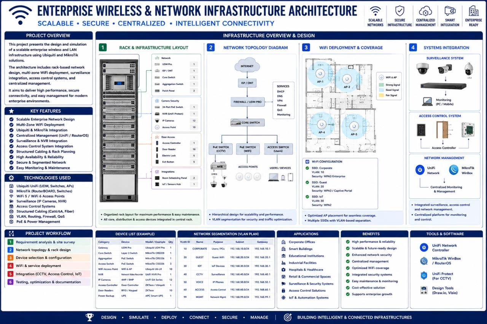
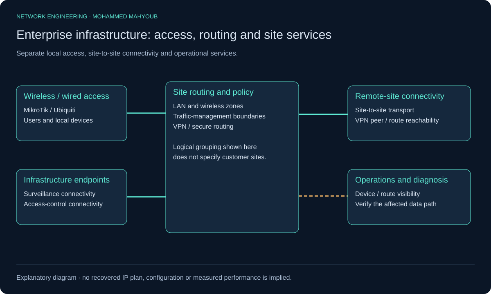
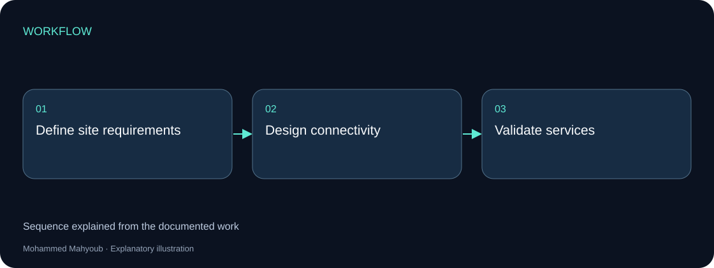
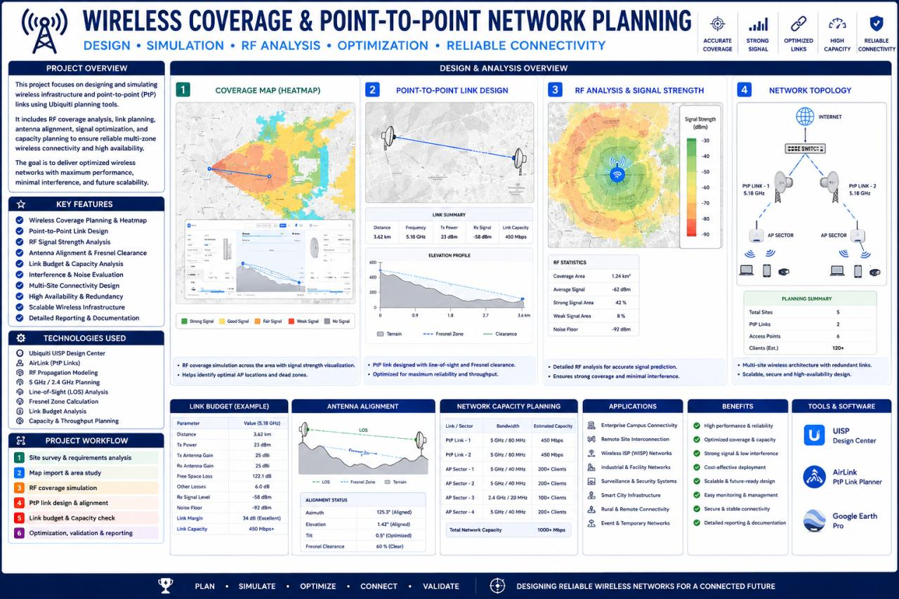
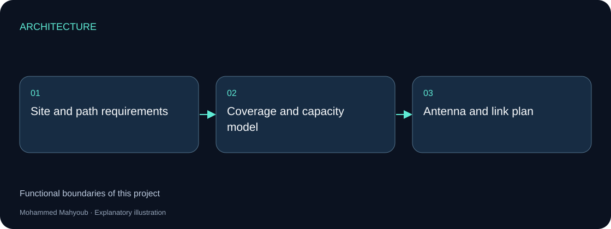
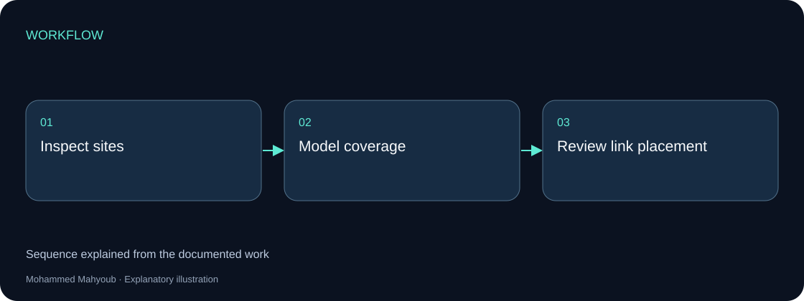
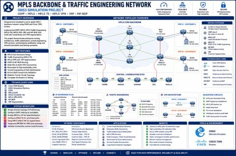
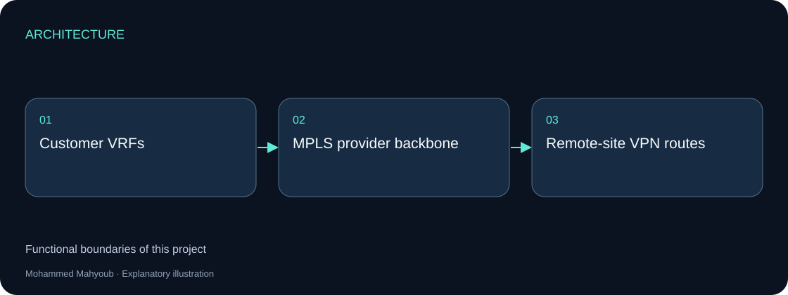
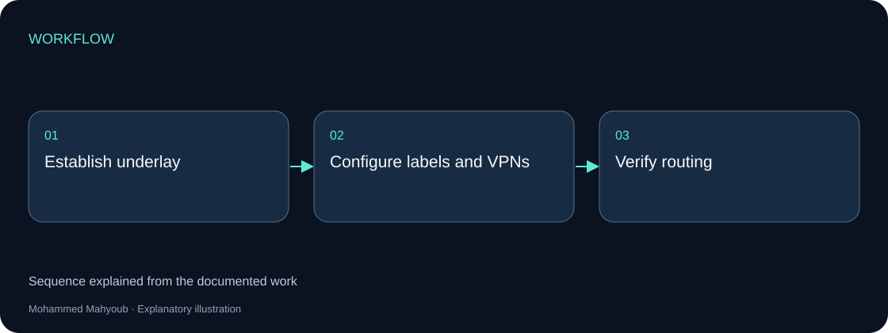

# Network Engineering — Independent Implementations

## Implementation at a glance

Three independent network implementations: enterprise access, wireless planning and an MPLS backbone. Their original project media remain associated with the correct implementation.

Each section below is a separate project. Images are existing source project media; the architecture and workflow figures are explanatory diagrams.

### Enterprise Wireless & Network Infrastructure Architecture

Multi-zone wireless and LAN infrastructure using MikroTik and Ubiquiti, with secure routing, VPN connectivity, traffic management and surveillance/access-control integration.

The source architecture documents how access and site services fit together. Coverage, routing and security are separate responsibilities; the explanatory diagram preserves those boundaries without inventing customer locations or an undocumented equipment schedule.

[Full project walkthrough](https://mahyoub88.github.io/projects/proj-enterprise-network/)

### Wireless Coverage & Point-to-Point Network Planning

Coverage modelling and point-to-point connectivity, considering antenna alignment, capacity and site coverage.

Planning combines the coverage view with the radio path and capacity requirement. The source image records the engineering planning work; no unrecorded throughput or field measurement is added.

[Full project walkthrough](https://mahyoub88.github.io/projects/proj-wireless-coverage/)

### Network Infrastructure Design — MPLS Backbone

A Cisco 7200 backbone built and validated in GNS3 using OSPF, MPLS traffic engineering, VRF/MPLS VPN and MP-BGP.

The original topology preview documents the configured network environment. This project is separate from the wireless deployments. Its GNS3 implementation is identified accurately rather than presented as a photograph of a physical carrier network.

[Full project walkthrough](https://mahyoub88.github.io/projects/proj-mpls-backbone/)

---

**Author:** Mohammed Mahyoub.

Designed and validated multi-site network infrastructure, from wireless access and RF links to a carrier-grade MPLS backbone, using MikroTik, Ubiquiti, Cisco, RF planning, and GNS3.

## Wireless

Multi-zone wireless and LAN architecture: coverage modelling, point-to-point links, antenna alignment, capacity planning, secure routing, VPN, traffic management, and surveillance and access-control connectivity.

## Backbone

Carrier-grade MPLS backbone built and validated with Cisco 7200 routers in GNS3: OSPF, MPLS-TE, VRF / MPLS VPN, and MP-BGP for multi-site connectivity and traffic engineering.

## Output

Network diagrams, equipment layouts, configurations, engineering calculations, and validation documentation.

## Technologies

Cisco, MikroTik, Ubiquiti, RF Planning, MPLS, OSPF, BGP, VPN, GNS3

## Links

- [Portfolio project](https://mahyoub88.github.io/projects/proj-rf-network/)

## Illustrated project pages

This repository is a source collection for separate implementations. Each project has its own scope, source visual and engineering walkthrough.

- [Enterprise Wireless & Network Infrastructure Architecture](https://mahyoub88.github.io/projects/proj-enterprise-network/)
- [Wireless Coverage & Point-to-Point Network Planning](https://mahyoub88.github.io/projects/proj-wireless-coverage/)
- [Network Infrastructure Design — MPLS Backbone](https://mahyoub88.github.io/projects/proj-mpls-backbone/)

[Browse all engineering case studies](https://mahyoub88.github.io/projects/)
