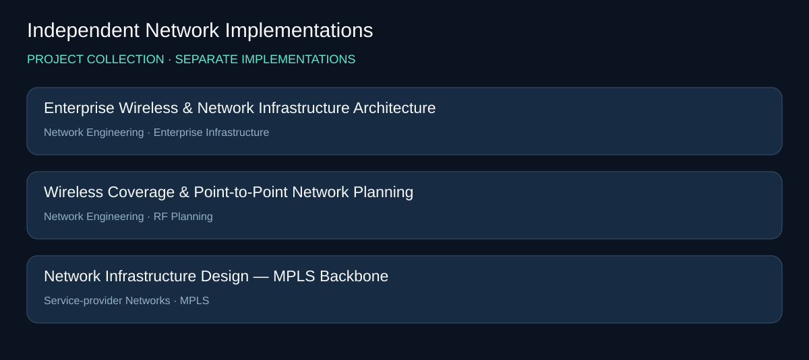
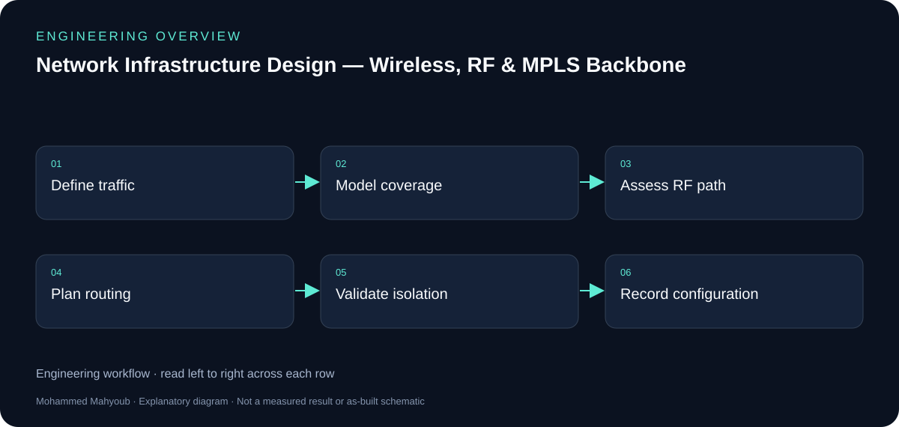

# Network Engineering — Independent Implementations

Designed and validated multi-site network infrastructure, from wireless access and RF links to a carrier-grade MPLS backbone, using MikroTik, Ubiquiti, Cisco, RF planning, and GNS3.

## Visual overview

*New explanatory diagram; grouped responsibilities, not an as-built schematic or test result.*

*New explanatory workflow; a documentation aid, not evidence that every proposed check was performed.*

## Access and backbone solve different problems

Wireless coverage and point-to-point links provide local access and site transport. Routing, VPNs and MPLS/VRF connect sites and separate service traffic. The new overview shows those functional layers without inventing an exact physical topology.

## RF planning

Coverage, antenna alignment and capacity must be evaluated together. The source material includes Ubiquiti planning views and a VB.NET link-budget tool. A favourable path-loss estimate alone does not demonstrate Fresnel clearance or capacity under interference.

## MPLS workstream

The documented Cisco 7200/GNS3 work uses OSPF, MPLS traffic engineering, VRF/MPLS VPN and MP-BGP. Configuration exports and route verification are stronger evidence than a topology picture alone; the checklist describes the evidence to attach without claiming unrecorded results.

## Evidence to review or collect

The following are suggested review checks. A checklist entry is not a claimed pass result.

- Coverage and RF path assumptions.
- Link budget and Fresnel clearance.
- VRF separation and route reachability.
- Configuration exports and traffic validation.

## Source gallery

*Enterprise Wireless & Network Infrastructure Architecture — LinkedIn project media.*

*Wireless Coverage & Point-to-Point Network Planning — LinkedIn project media.*

## Sources and provenance

- [Published portfolio description](https://mahyoub88.github.io/projects/proj-rf-network/).
- [Project README](../README.md) and existing repository files.
- [LinkedIn projects](https://www.linkedin.com/in/mohammed-mahyoub/details/projects/): supplementary descriptions and project media.
- New SVG figures and explanatory text were authored for this documentation update; they are not original photographs or new measured results.
- Reused JPG media were exported from the corresponding LinkedIn project media viewer. Source titles are preserved in the captions; no expiring image URLs are required.

## Additional source media

*Network Infrastructure Design — MPLS Backbone (GNS3): existing LinkedIn experience media, exported from the media viewer. This is the available preview resolution; it is a source summary sheet/screenshot, not a new measurement.*

Source: [LinkedIn experience media](https://www.linkedin.com/in/mohammed-mahyoub/details/experience/).

## Illustrated project pages

This repository is a source collection for separate implementations. Each project has its own scope, source visual and engineering walkthrough.

- [Enterprise Wireless & Network Infrastructure Architecture](https://mahyoub88.github.io/projects/proj-enterprise-network/)
- [Wireless Coverage & Point-to-Point Network Planning](https://mahyoub88.github.io/projects/proj-wireless-coverage/)
- [Network Infrastructure Design — MPLS Backbone](https://mahyoub88.github.io/projects/proj-mpls-backbone/)

[Browse all engineering case studies](https://mahyoub88.github.io/projects/)
